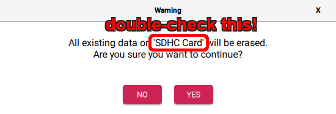
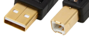
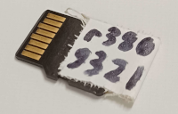
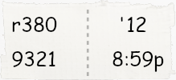
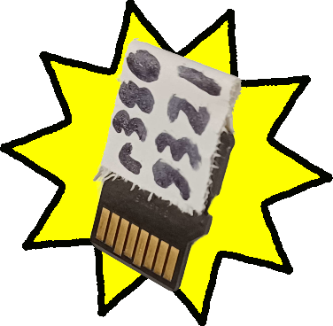
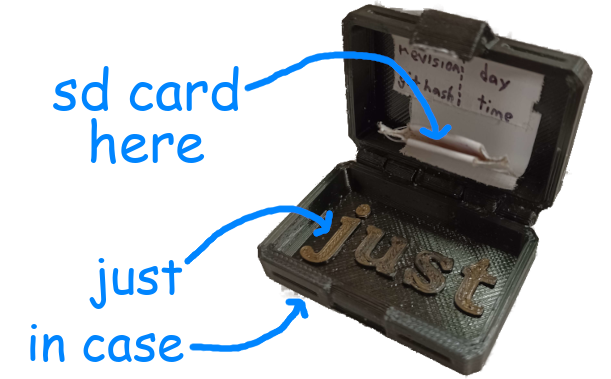

# Making an SD Card Backup at a Competition

When the robot's code is modified during a competition, we back up the new code on an SD card. This is so that, should the main SD card get corrupted, we can quickly recover.

# Re-Imaging
*We usually only do this once at the start of the competition, once at the end of the qualification matches, and always if the card corrupts.*

- You'll need a driver station laptop with an SD card port or adapter.
- There are several tools to flash SD cards with, but the most reliable one is the [**Raspberry Pi Imager**](https://www.raspberrypi.com/software/) (though [balenaEtcher](https://etcher.balena.io/) also works).
- You'll need to find the roboRIO2 image. It's usually located at `C:\Program Files (x86)\National Instruments\LabVIEW 2023\project\roboRIO Tool\FRC Images` (and it's been copied to Downloads on at least one laptop), but failing that you can open the *roboRIO Imaging Tool* and click the "SD" folder icon. The zip should have both "roboRIO2" and the current year in the name, e.g. `FRC_roboRIO2_2025_v2.0.img.zip` (it may be in a subfolder).
- To flash with **Raspberry Pi Imager**:
    - Press `CHOOSE OS`, select *Use custom* at the bottom of the list, and select the .zip you found above.
    - Press `CHOOSE STORAGE` and select the SD card (usually appears as "SDHC Card").
    - Press `NEXT`, answer `NO` to the customization question, and, after confirming that the SD card is the device named, confirm `YES` to the erasure warning.    
    
    - Wait for the flashing to finish.

# Number Setting and Code Deploying
*The team number needs to be set at least once after flashing, and the code should be redeployed whenever new fixes are made. Both of these require a connection to a roboRIO2.*

## Connecting to the roboRIO2

- Using a standalone RIO setup is preferred, but lacking that, the actual robot works too. The Electrical team can help you get the standalone one working.
- Make sure you **never** insert or remove the SD card while the RIO is powered; this will most likely corrupt it. Powering off the RIO while deploying code is also not a good idea.
1. Insert your flashed SD card and turn the RIO on.
2. Connect to the RIO with a USB printer cable (A to B):  
    
3. Once the RIO is booted up, it should appear in the Driver Station software. (`No Robot Code` is fine, `No Robot Communication` is not)

## Setting the Team Number

- You can check if the team number is already set in two ways:
    - In **Driver Station**, if the RIO is connected, it will show the team number of the RIO above the battery voltage. If the team number is wrong, or it shows *"Team # USB"*, you need to set the team number.
    - The **roboRIO Team Number Setter** will show RIOs it finds as *"NI-roboRIO2-..."* if the number is unset and *"roboRIO-XXXX-FRC.local..."* if it is. Again, you need to set the team number if it's unset or wrong.
1. Open the [**roboRIO Team Number Setter**](https://docs.wpilib.org/en/stable/docs/software/wpilib-tools/roborio-team-number-setter/index.html) and set the team number at the top of the window to `2122`.
2. Find the roboRIO you want to set in the list and click `Set team to 2122`.
3. If you want to confirm that the number is right, reboot the roboRIO and then check again.

## Deploying the Code

1. Connect to the Internet. This can be via a mobile hotspot, a Wi-Fi network that allows GitHub, or a VPN over a network that doesn't.
2. Checkout the correct branch (`git checkout branch_name`). Most of the time, the branch used at a competition will start with `event_`.
3. If you checked out a branch, use `git pull` to get the latest commits from the branch.
4. Use <kbd>Ctrl</kbd>+<kbd>Shift</kbd>+<kbd>P</kbd> to open the command palette, type `deploy`, and select "WPILib: Deploy Robot Code"
5. Wait for the deploy to finish.

## Test the code
1. Open the Driver Station software (looks like a play button in a gray box).
2. Wait for it to connect to the robot and load (it should say "Teleoperated Disabled" or similar, not "No Robot Code" or "No Robot Communication").
3. Make sure the code isn't complete buns by selecting `TeleOperated`, enabling, disabling, selecting `Autonomous`, enabling, and disabling. At no point during this should the robot code crash. (If it does, then you may need to look into that instead of putting bad code on the SD card.)
4. At this point, the SD card is ready. Disconnect the RIO2 from power and take out the SD card.

# Writing a Tag
*Once an SD card is ready, we put a small tag on it so we know exactly what version of the code is on it.*   
  
*(Please write more legibly than this - I wrote this with a rather imprecise sharpie)*  

## Getting the info from gitTag
On the driver stations, there may be a Python script called `gitTag.py`. It's usually in the "code" folder, above the robot project folders.
1. Open a terminal in the project folder and run `python ../gitTag.py gui`. If it can't find that file or otherwise can't open, go to the section below.
2. If it does open, it will have all the information from the last code built.

## Getting the info from BuildConstants.java
*because that's really where gitTag gets it from*
1. Open `src/main/java/frc/robot/BuildConstants.java`.
2. Read your info:
    - `GIT_REVISION` is your revision id
    - First four characters of `GIT_SHA` is your hash
    - `GIT_DATE` has your day and time, though the time is in 24-hour format

## Write it on a tag
Here's what the areas on a full tag mean, plus an example:  
 
- The **revision ID** is a number that says where in the history a commit is; e.g. `r380` is the 380th commit on this branch
- The **hash** is some hexadecimal that uniquely identifies a commit across all branches
- The **day** and **time** are just that - the tag above describes 8:59 pm on the 12th

### And now, to write:
1. Get a piece of tape. It should be big enough to hold all the info, but probably shouldn't be much taller than the SD card itself.
2. Writing using an ultra-fine marker is best, though a pen could also work (but it smudges, so don't prefer it).
3. You'll want to write at *least* the hash and revision ID - the hash can identify the commit and the revision can put two SD cards in the correct order - but writing the time is also good.
4. Once written, fold the tape over the back of the SD card as pictured above (avoid the contacts).

# And now you finally have an SD card ready for a rescue!
  
Now you just need to give it to Wibbels or another mentor on/near the drive team. If they've managed to survive since we got them in 2024, you can put it in the Just In Case(patent pending) for safekeeping.  

