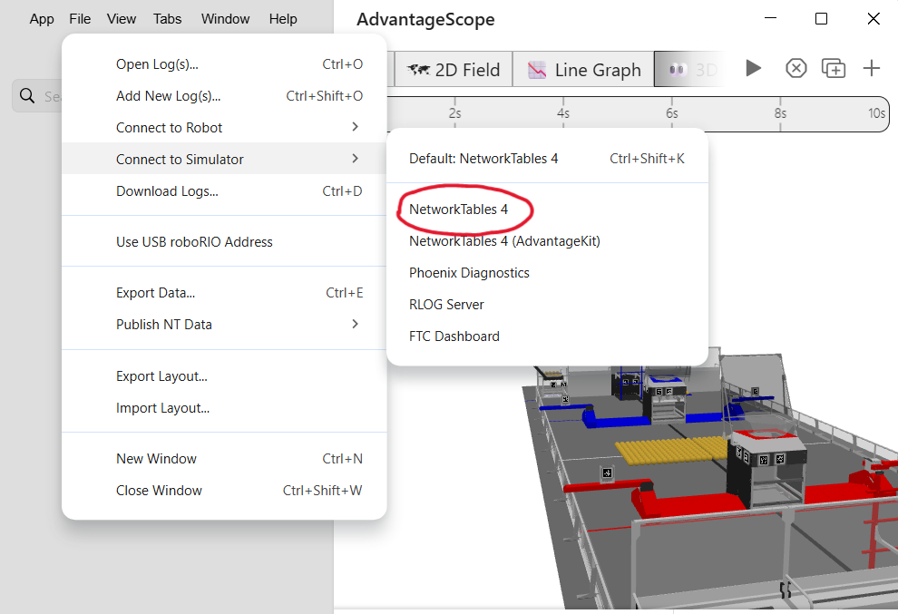
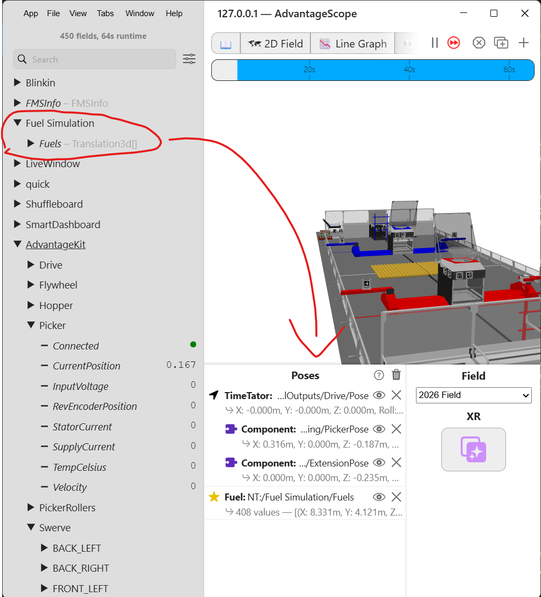
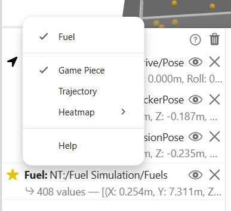

# Fuel Simulation in AdvantageScope

## Intro
This is an expansion of the project of adding the 3d model created in OnShape to AdvantageScope in order to better visualize systems in simulation.

This section covers the simulation of Fuel, the 2026 REBUILT game piece. It uses a [physics simulator](https://github.com/hammerheads5000/FuelSim) specific to the Fuel created by team 5000, HAMERHEADS, with some modifications to make it useful to our late-onseason bot, which didn't use a turret, but rather one long continuous "wall".

Although, at the time of writing this, there is no implementation of collision between the robot and the field obstacles, the purpose of this project was to be able to have a pretty solid way to simulate shooting using the actual voltage and controller inputs, without needing the physical robot. This was done in order to allow programming to be able to test more things while the robot isn't available for one reason or another.

## Components of Fuel Simulation
As previously stated, the majority of the code used in simulating the robot comes from a lightweight library created by HAMMERHEADS. This allows us to spawn Fuel at any point on the field, intake it via our picker, and shoot it. This section covers how each of these tasks works on a basic level, as well as what values you need to do these things and where some of those values are found.

<details>
<summary> Spawning Fuel </summary>

Using the function `spawnStartingFuel()` spawns the Fuel in a rectangular grid at the center of the field, as well as the fuel inside the depot. Fuel inside the outpost is not spawned however, since there is no way to release the fuel from inside anyway.

You can also spawn Fuel individually using the `spawnFuel()` function, which takes the position and velocity as `Translation3d` values, and is what is used for launching Fuel.

Both of these add Fuel to the `fuels` array, which is needed to do things like removing Fuel or checking if Fuel is able to be picked.

There is no need to import a new Fuel model, as there is one automatically in AdvantageScope.
You do not need any additional values to spawn Fuel.
</details>

<details>
<summary> Intaking Fuel </summary>

A function called `shouldIntake()` returns a boolean checking if a given Fuel is between the minimum and maximum X and Y values for the picker, which represent length and width. Using this, we can check if every single Fuel on the field, which is stored in an array, is within those limits. If so, another function, `handleIntakes()`, removes them from the field and updates the Fuel count inside the hopper when given the array of Fuel as an argument.

To perform this task, you need...
* The minimum and maximum X and Y values of how far the picker reaches outside of the robot. 
> For the maximum X value, the length of the picker was added to the X value of the picker rotation point, or the minimum. For the Y min, this was negative value of the robot's length divided by 2, while the max is this value but positive. As the robot needs to be rotated 90 degrees about the X axis when being implemented into AdvantageScope to be facing upright, the Y value represents how wide the picker is rather than the height.

</details>

<details>
<summary> Shooting Fuel </summary>

If you have one or more Fuel inside your hopper while giving the robot the input to shoot, a function called `launchFuel()` spawns the Fuel at a given point with X, Y, and Z values, then applies the linear velocity (in meters per second) and the shot angle. Since we use angular velocity for our flywheel's input, you must convert it from rotations per second to meters per second by performing the equation:

```
Radius of flywheel * rotations per second * 2π
```
In the onseason code for this simulation, we spawn the Fuel at 3 points along the shooter "wall", since more than one Fuel are shot at once. This is just done by calling the `launchFuel()` function 3 different times in the same method, `launchTripleShot()`.

When the hopper contains 1-2 Fuel instead of 3, `launchSingleShot()` is called instead, calling `launchFuel()` only once with the location of the center of the shooter as the location arguments.

To use this function, you need...
* Rotation of flywheel in MPS
* Radius of flywheel
* Spawn point of the Fuel
* Shot angle

> In the code for the 2026 onseason robot, the shot angle is found through trial and error, and ranges from 0 to 90 degrees, where 0 degrees is shooting directly upwards and 90 degrees is completely horizontal.

</details>

## Setup

### Functions that need to be called
These are the functions to be called in order for the simulation to function properly, although some are not necessarily required for the simulation to work, such as air resistance. It is best practice to only call these things only if the robot medium is SIM to not waste time computing the position of hundreds of Fuel while the robot is physically running, but the classes `FuelSim` and `FuelSimCore` need to be initialized regardless.

#### Robot.java
<details>
<summary> Called upon initialization </summary>

* `start()`
> resets the logging timer for the Fuel and allows the simulation to be updated.
* `setSubticks(number)`
> required for collisions between the Fuel and the field components such as the Bump and Trench. The default is 10.
* `enableAirResistance()`
>This is optional, but there is not much of a reason not to use it in most cases, as it makes the simulation more realistic.
* `registerRobot()`
> This includes the length, width, and height of the robot, alongside its current Pose3d value and speed. This is critical to picking and shooting, as these functions do not work without it.
* `registerIntake()`
> This includes the minimum and maximum X and Y values of the picker, as previously discussed in the Intaking Fuel Section, and of course is critical to being able to simulate picking Fuel.

</details>

<details>
<summary> Called periodically </summary>

* `updateSim()`
> This is what is used to apply air resistance and collision with objects such as the Hub or the robot, and then logs the new Fuel position.
* `intakeFuel()`
> Is constantly checking if the picker is deployed, and, if so, intakes the Fuel within the limits of how far the picker extends.
* `getFuelStoredCount()`
> Logs the amount of fuel within the hopper, which is a value needed for things like checking if you can shoot or not.
</details>

#### Subsystems
* Flywheel

`shootInSim()` checks how many fuel are inside the hopper, and then spawns the correct amount of fuel based on that number with the velocity converted from the flywheel's rotations per second (see the Shooting Fuel section). If it is 3+, it spawns 3, if there are 1-2, it spawns 1, and if there are no Fuel in the hopper, it just doesn't spawn any fuel. When given a continuous input to shoot, it waits in between shooting bursts of Fuel so the balls per second shot are accurate.

`shootInSim()` is called from the `shoot()` command based on whether or not the robot medium is SIM, once again to not compute the position of hundreds of Fuel for no reason while the robot is running in real life. Within this function is the logic for how much fuel to spawn with `launchFuel()`.


* Picker

`ableToIntake()` checks if the picker is deployed and in position in order to ensure that the robot is only picking Fuel in simulation whilst the picker is down.

### Starting the simulation
Once you have registered your robot and intake, you can now run the simulation for yourself! The following is the very simple list of steps required to get the simulation up and running.

* Simulate the robot code and open up AdvantageScope

* Go to File > Connect to Simulator > Network Tables 4
> The option for adding Fuel to the 3d field doesn't appear using NetworkTables 4 (AdvantageKit), so using NetworkTables 4 is required, I fear.


* Select `2026 field` from the menu on the right side

* If you initialized the things for Fuel simulation inside of teleopInit, set the current game mode to teleop, then drag in the Fuel poses, Drive pose, and component poses into the bottom middle box named **Poses**. (The Fuel pose array is under the Fuel Simulation tab)
> This obviously requires the 3d model for the robot being implemented for actions like picking, so if you don't know how to do that, read the documentation on implementing the 3d models into AdvantageScope.



* Make sure that the Fuels array is set to the Fuel object. If it doesn't say Fuel in bold with a star next to it, click on the icon and click Game Piece > Fuel.


* That's it! Drive around, pick, shoot, whatever.

Of course, all of this is specific to the simulation of the 2026 game piece, but the goal is to be able to carry over some of this into future games. Hope this helped!


