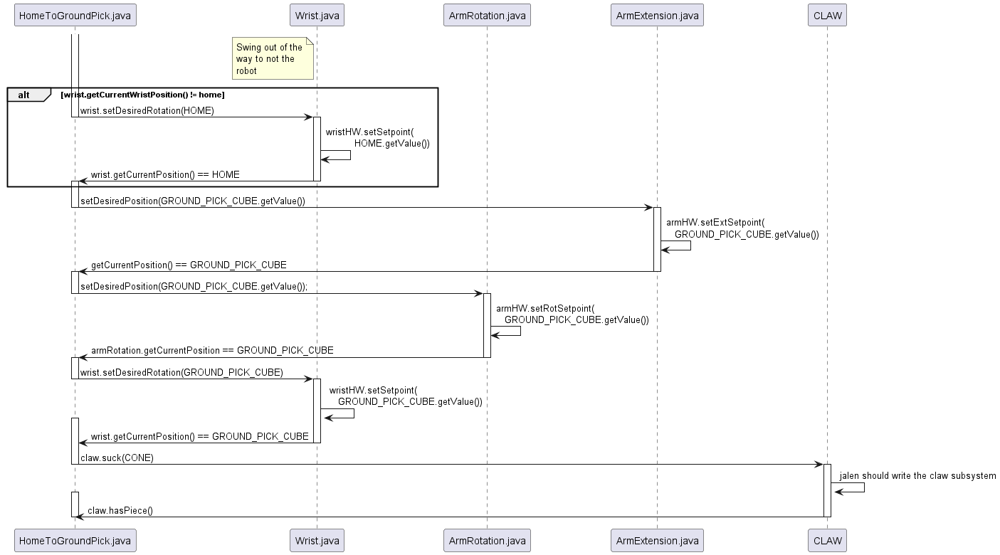
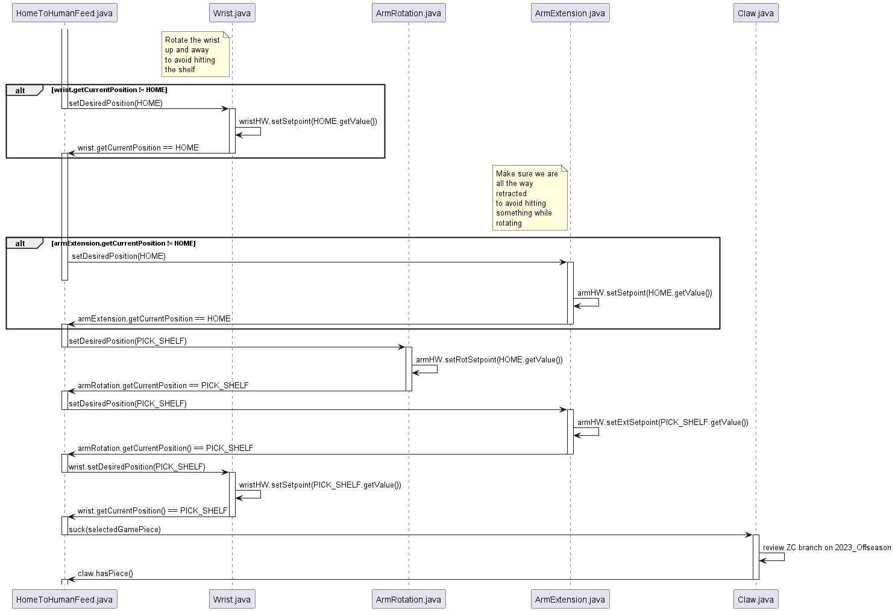
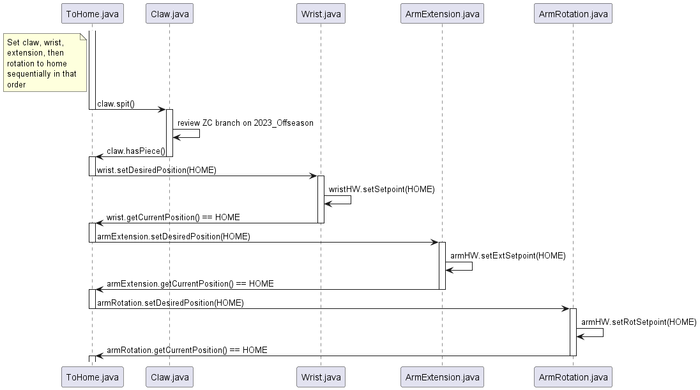

# 2023 Offseason - Imitator

The 2023 offseason robot does not have proper documentation, and there only
exists a select few sequence diagrams detailing how each action should be
performed. An example sequence diagram can is shown below.

## Home to Ground Pick Cone

## Home to Ground Pick Cube

## Home to Human Feed

## Home to Place

## To Home

