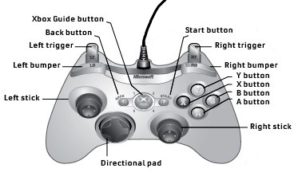

# Architecture Spec

## Introduction

The architecture spec describes the overall intended design of the 2024 Offseason robot (TatorSwift). This includes designs for the various algorithms and how various components should interact. This document should be readable without having any understanding of code, and should not be dependent on any particular code implementation.

## How to Read the Diagrams
The following diagrams can be understood through these example diagrams:
### State Machines
**State Machines** have a state, and can transition between states based on conditions or commands.

### Sequences

**Sequence Diagrams** describe how different parts of the robot interact to preform a complicated action.

### Gamepad
For reference, here are the names of the buttons on a gamepad:

## Design of Subsystems

### Picker
The **Picker** can obtain notes on the ground from either side and feed them into the **King Rollers**.

#### State Machine

#### Sequence Diagram

#### Directly Responsible Individuals:
- Cedar (Programming)
- Ian (Programming)
- Zach (Mechanical)
- Nate (Mechanical)
- Vedika (Mechanical)

### King Rollers
The **King Rollers** can hold a note from the **Picker** until it's ready to be fed into the **Upper Note Path**.

#### State Machine

#### Directly Responsible Individuals:
- Cedar (Programming)
- Ian (Programming)
- Tristan (Mechanical)

### Upper Note Path
The **Upper Note Path** can take a note from the **King Rollers**, shoot it, or dunk it in the amp or trap.

#### State Machine
Note that this state machine has extra elements:
- **Sub-state machines** are smaller state machines controlled by the main state machine's states. Only up to one sub-state machine can be active at once.
- The **red diamonds** are for indicating that a **substate** cannot be interrupted.

#### Sequence Diagrams
- Amp

- Trap

#### Directly Responsible Individuals:
- Cedar (Programming)
- Ian (Programming)
- Tristan (Mechanical)

### Pivot
The **Pivot** can angle the **Upper Note Path** for shooting/amping/trapping.

#### State Machine

#### Directly Responsible Individuals:
- Cedar (Programming)
- Ian (Programming)
- Bentley (Mechanical)
- Tristan (Mechanical)

### Extension
The **Extension** is mounted to the **Upper Note Path** and is used to carry a note out to the trap.

#### State Machine

#### Directly Responsible Individuals:
- Cedar (Programming)
- Ian (Programming)
- Nate (Mechanical)

### Climber
The **Climber** can pull the robot up the chain on the Stage.

#### State Machine

#### Directly Responsible Individuals:
- Cedar (Programming)
- Ian (Programming)
- Esther (Mechanical)
- Omar (Mechanical)

### Drivetrain
The **Drivetrain** controls the swerve drive.
#### State Machine

#### Directly Responsible Individuals:
- Cedar (Programming)
- Ian (Programming)
- Ossian (Mechanical)

### Blinkin (LEDs)
The **Blinkin** LEDs are mounted to the outside of the robot and show the driver what the robot is doing at a glance.
#### Flowchart

### Network Tables
The **Network Tables** are a system to communicate between the robot code and other devices, e.g. cameras and the Driver Station.^[more on Network Tables at [the WPILib docs](https://docs.wpilib.org/en/stable/docs/software/networktables/networktables-intro.html)]

