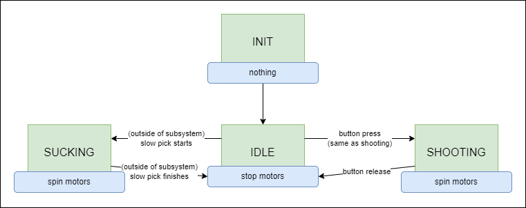
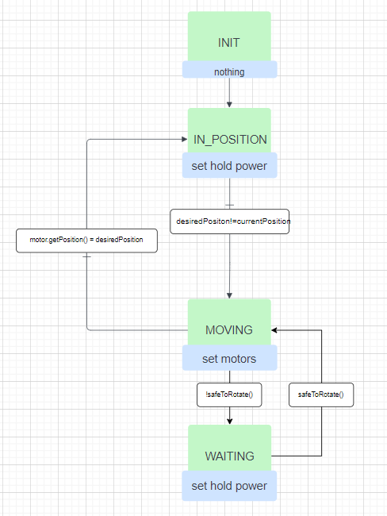
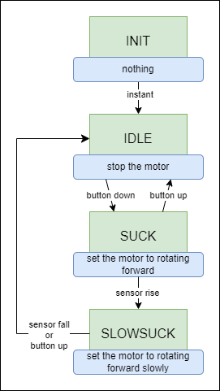
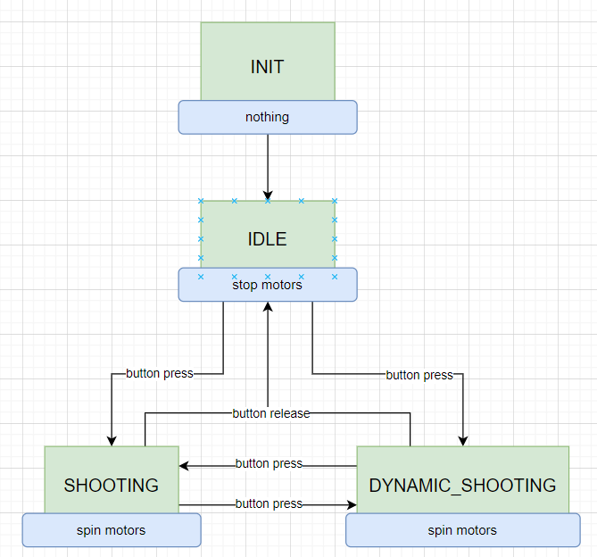

# Architecture Spec

## Introduction

The architecture spec describes the overall intended design of the 2025
competition robot (tidaltator). This includes designs for the various algorithms
and how various components should interact. This document should be readable
without having any understanding of code, and should not be dependent on any
particular code implementation.

## How to Read the Diagrams

The following diagrams can be understood through this example diagram:

**State Machines** have a state, and can transition between states based on conditions or commands.

## Design of Subsystems

### Affector

The **affector** manipulates the note into the robot, and can then either feed
the note into the shooter or in the reverse direction to score in the amp or
trap.

### Arm Rotation

The **Arm Rotation** subsystem rotates the arm on a pivot near the shooter.

### Picker

The **Picker** subsystem grabs the notes from the ground and feeds them into the
**Affector**.

### Shooter

The **Shooter** subsystem accepts notes from the **Affector** and shoots them
into the speaker.

