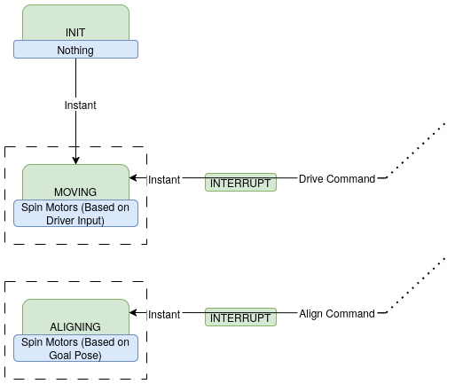
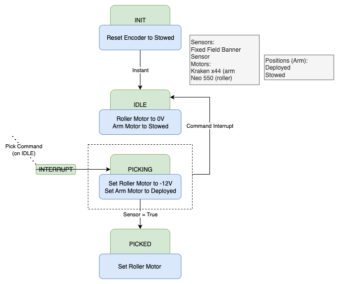
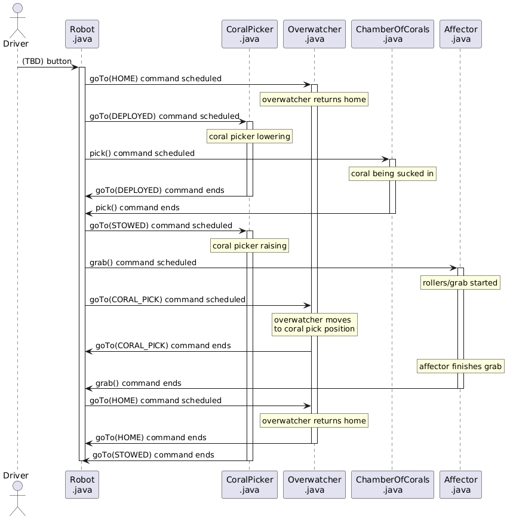
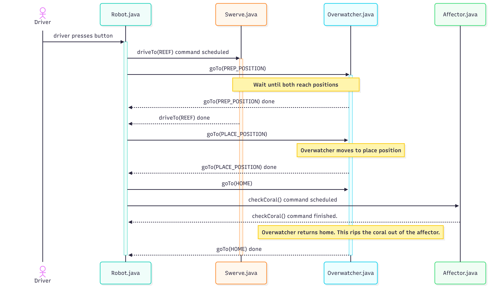

# Architecture Spec

## Introduction

The architecture spec describes the overall intended design of the 2025 off-season robot (aquatator). This includes designs for the various algorithms and how various components should interact. This document should be readable without having any understanding of code, and should not be dependent on any particular code implementation.

## How to Read the Diagrams
The following diagrams can be understood through these example diagrams:

### State Machines
**State Machines** have a state, and can transition between states based on conditions or commands.

### Sequences
**Sequence Diagrams** describe how different parts of the robot interact to
perform a complicated action, and are implemented as command structures with the
WPILib command based framework

## Subsystems

### Blinkin
The **Blinkin** LEDs are mounted to the outside of the robot and show the drivers the status of the robot.

### Swerve Drive
The **Swerve Drive** controls the swerve modules used to move the robot around.

### Chamber of Corals
The **Chamber of Corals** processes coral from the picker to the affector.

### Overwatch
The **Overwatch** takes the place of both the **Lift** and the **Pivot**, and navigates between set positions using A*.

[More on the Overwatch](overwatch.md)

### Affector
The **Affector** picks up the coral from the **Chamber of Corals** and then drops the coral on the reef. It also picks up algae.

### Coral Picker
The **Coral Picker** picks up coral and sends it to the Chamber of Corals.

### Climber
The **Climber** holds onto the cage and lifts the robot off the ground.

### Algae Picker
The **Algae Picker** picks up algae and holds it in place for the affector

## Sequences Diagrams/Command Structures

### Coral Picked From Ground

### Coral Picked From Station

### Coral Place

