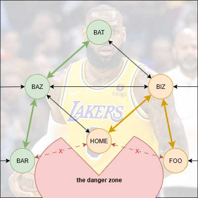

# Overwatch

## Overview
- The Overwatch directs the Lift and Pivot systems to follow a path from Point A to Point B.
- This path is determined by an A* algorithm and a set of known positions.
  There is also an area defined as unsafe that paths cannot cross. This corresponds to other parts of the robot, e.g. the base, pickers, coral chamber, etc.

> 

> An example node graph. The X axis is the pivot's angle, and the Y axis is the lift's height. The pivot can go in a circle, so the X axis can loop around.

- Clockwise/counterclockwise are as viewed from the right side of the robot (the side where the arm is closer than the lift)
## API
- `goTo(node[, direction])` is a method that returns a Command. It drives the lift and pivot to a specific `Node`. The direction can be specified to force the pivot to rotate either clockwise or counterclockwise to the destination.
- `atGlobalSetpoint` is a Trigger that activates when the system is at the goal it's set to. You can use `atGlobalSetpoint.getAsBoolean()` to directly get a true/false value, or use it in [any other way you can use a Trigger.](https://docs.wpilib.org/en/stable/docs/software/commandbased/binding-commands-to-triggers.html)
## Moving
- The code first finds the optimal path from the current position (which may not be on a defined node) to the goal node.
  The direction (clockwise or counterclockwise) can be forced to a specific one, or the code can find the shortest path and use that.
- Then, the edges between the nodes on the path are followed in sequence, by the pivot and lift simultaniously.

> 

> Navigation between points. The fastest path between BAR and BAT is through BAZ, and the path from HOME to FOO goes through BIZ to avoid the danger zone.
