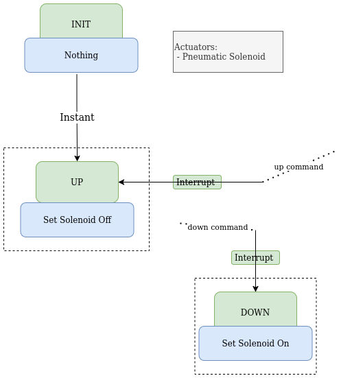
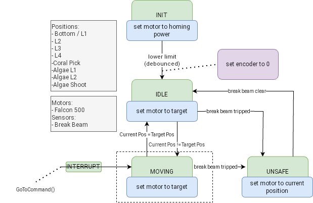
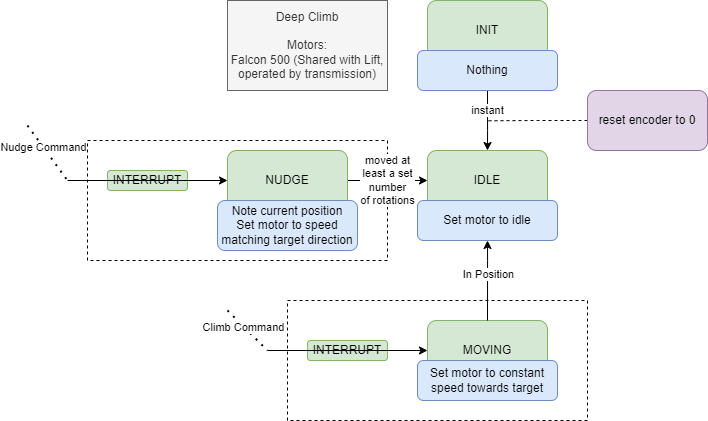
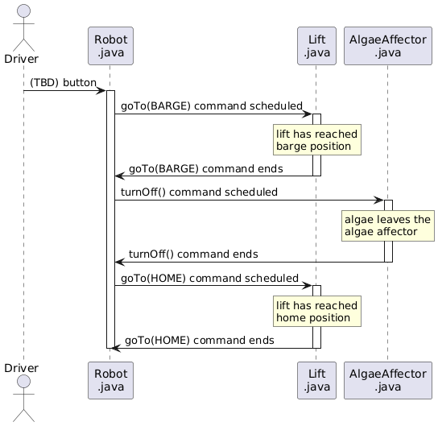
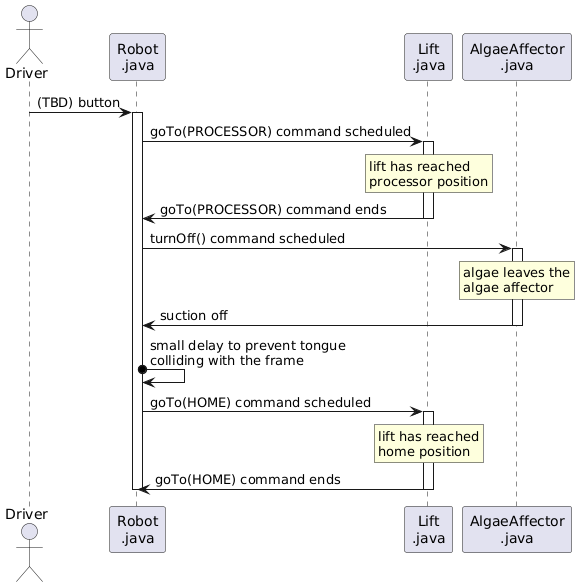
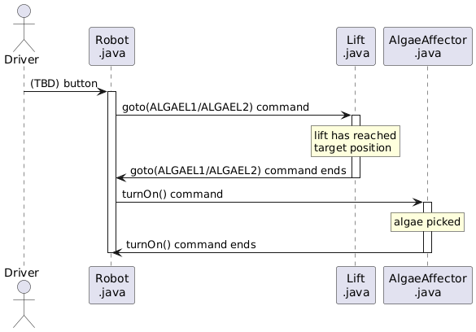
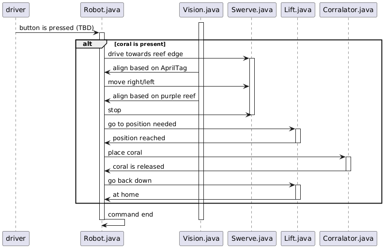

# Architecture Spec

## Introduction

The architecture spec describes the overall intended design of the 2025 competition robot (tidaltator). This includes designs for the various algorithms and how various components should interact. This document should be readable without having any understanding of code, and should not be dependent on any particular code implementation.

## How to Read the Diagrams
The following diagrams can be understood through these example diagrams:

### State Machines
**State Machines** have a state, and can transition between states based on conditions or commands.

### Sequences
**Sequence Diagrams** describe how different parts of the robot interact to
perform a complicated action, and are implemented as command structures with the
WPILib command based framework

## Design of Subsystems

### Algae Holder
The **Algae Holder** is a stick that pops out to help control algae on the
ground

### Algae Affector

The **Algae Affector** can grab and release algae.

### Coral Affector

The **Coral Affector** can pick coral from the ground and place coral on the reef branches.

### Elbow 

The **Elbow** controls the angle of the forearm on which the **Wrist** and
**Coral Affector** are mounted. The height of the **Lift**, and the angles of
the **Elbow** and **Wrist** combine to put the **Coral Affector** in various
positions for ground picking coral and placing coral at levels CORAL_L2 -
CORAL_L4. #### State Machine 

### Wrist 

The **Wrist** extends and retracts the **Coral Affector** working with the **Elbow** and **Lift**. 

 

### Drivetrain

The **Drivetrain** controls the swerve drive.

### Shift

The **Shift** manages the Lift and Climber systems using the same motors.

#### Lift

The **Lift** moves the coralator and the algae affector up and down.

#### Climber

The **Climber** can climb on a deep cage.

  
## Sequences Diagrams/Command Structures

### Placement of algae in the barge

### Placement of algae in the processor

### Picking of algae from the reef

### Robot climbing on the deep cage

### Coral picking

### Placement of coral

