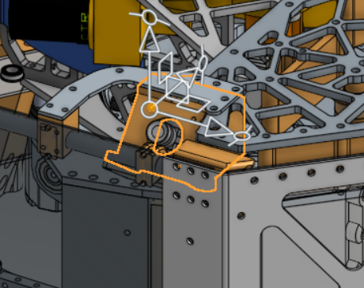
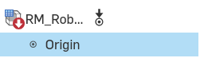
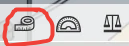
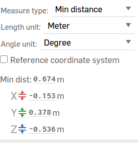
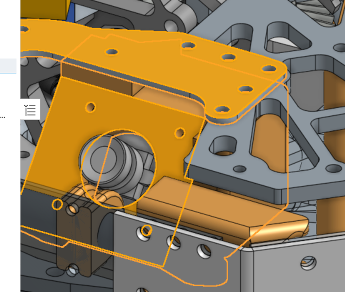

# Configuring Vision on the Robot


Vision, the subsystem we use to detect the April Tags on the field, takes some mildly painstaking setup when loading it on the bot for the first time. Fortunately, we put together this documentation page, hopefully preventing us from needing to track down a Tator of years past to help in the future.


## Pre-Deployment setup


Before we get the cameras to detect the tags, we need to do a couple of things.


### Setting Camera Poses
For this, it depends on what software we are running, whether that is Limelight or PhotonVision (you can even run PhotonVision *software* on a Limelight camera *hardware*, which we have done before).


For Limelight, camera positions are set within the web interface, which we will get to in a second. However, for PhotonVision, we set these positions in the code.


```
 public static final Transform3d LEFT_CAM_POS =
     new Transform3d(
         new Translation3d(0.159, 0.382, 0.527),
         new Rotation3d(Degrees.zero(), Degrees.of(-40), Degrees.of(90)));
```


The above is an example of the position of a right-facing camera which uses PhotonVision. The `Translation3d` takes in the input of the X (distance in front of/behind the origin assuming the robot is facing forwards), the Y (distance left/right of the origin assuming the robot is facing forwards) and the Z (distance above/below the origin) distances from the origin of the robot in meters.


Meanwhile, the `Rotation3d` determines how the camera is rotated in roll, pitch, and yaw. Roll pitch, and yaw are applied in the order of yaw, pitch, and then roll, so basically backwards of the order they are defined.


How I visualize it is that roll rotation works like how a steering wheel spins, moving horizontally along a lateral axis. Pitch moves up and down, like nodding your head, while yaw is like shaking your head, turning side to side. The negative value in the roll argument above indicates that the camera is pointing up by 40 degrees. To indicate that our camera is facing right, we turn 90 degrees clockwise for the yaw argument. If we were facing left, this number would be negative.


To get both the angles and positions of the camera, we can turn to Onshape. If you don't have access, you definitely should ask whoever is in charge of CAD fall training, and it is generally wonderful for getting a lot of values and gaining an understanding for how things work instead of pestering mechanical.


**Note**: make sure to be respectful of the Onshape documents, especially if you aren't on mechanical yourself and don't work with the CAD. For example, if it says you made any changes while you were just looking around, try to spam Control+Z in order to undo them, and try to refrain from hiding objects.


#### Getting camera positions


1. Open up the Robot Master document, then find and click on your camera.





2. Then, find the origin (whether by clicking on it or just finding it inside the file tree).





3. Click the little measuring tape icon in the very bottom right.





4. Change your distance-measuring unit to meters and just like that, you have your inputs for your camera `Translation3d`!





Assuming the robot is facing forwards and we are looking at the back, if your camera was on the right-hand side, then your Y value (distance right/left) would need to be negative. In the same vein, if your camera was on the front half of the robot instead of the back half, then your X value would be negative. Your Z value should never be negative because then our camera would be underground, and I doubt there are many April tags down there.


#### Getting camera rotation


1. Click on your camera again. Make sure you are clicking on the entire camera rather than just the lens part.


2. Then, click on a surface that is flat relative to the camera. Now, your selections should look something like the image below, with one flat object and then your camera:





If the objects were selected correctly, the angle should just appear in the bottom right corner right next to where the measuring tape icon is.


If you selected incorrectly, you can just click off of the robot and try again.


3. Subtract 90 degrees from that value you got if your flat surface was above your camera. For example, if it showed 50 degrees, we know that our camera is tilted 40 degrees upwards (even if you get a value that is greater than zero, you should still negate it if our camera is pointing upwards, which it should be in basically every single case)


4. Input that into the `Rotation3d`! Remember, roll rotates like a steering wheel, while pitch and yaw are like nodding and shaking your head respectively. So, the value we just got corresponds to yaw, since we are looking at how far up/down the camera is tilted.


If cameras were tilted sideways, I think you could just select a surface that would be vertically straight, like the hopper wall, instead of a horizontally flat surface with yaw.

### Downloading the software

Here are the requirements for the apps you must have installed to do this. You can just download them from the links provided. 

[Raspberry Pi Imager (PhotonVison ONLY)](https://www.raspberrypi.com/software/)
This is what we use to put PhotonVision on whatever camera we are using. There is a tool native to PhotonVision to do this as well. It can be a little unfriendly to use, but it is still an option.

[PhotonVision Image (PhotonVision ONLY)](https://github.com/PhotonVision/photonvision)
For this one, just go to the latest version tag and install the image for the type of hardware you are using.

[Limelight OS/Limight Hardware App download (Limelight software ONLY)](https://docs.limelightvision.io/docs/resources/downloads)
Go to the latest version of Limelight OS and install the zip file for whichever limelight you are using. From here, you can also install the Limelight Hardware Application, which you should install based on what type of computer you are using.

#### PhotonVison - Installing onto the camera
1. Plug your computer into the camera via a USB cable (The robot should be on and the camera properly plugged in)

2. Open up the Raspberry Pi Imager

3. Select the type of camera, then click `use custom` for the OS (it should be all the way at the bottom)

    3a. select the .img file you downloaded earlier from the github repo

4. For storage, the camera you are plugged into should pop up. NEVER EVER uncheck the box that excludes system devices, unless you want to end up deleting your computer boot, which is not a great plan.


After around 15 minutes, it should be ready to run! Repeat the previous steps (minus installing the apps and images of course) for all of your cameras.

#### Limelight - Installing onto the camera

The robot that I, the writer of these docs, helped set up vision for exclusively used PhotonVison, so I fear I have no wisdom to give on this, but it should be a very similar process. Here's some very straightforward docs on flashing the OS using the limelight hardware manager from another team, at least!

[Flashing LimelightOS to a camera](https://wiki.yetirobotics.org/books/robot-software/page/flashing-limelights)

### Getting/Setting the IP addresses

Now that we have our camera positions and they have their operating systems installed, we need to open up the web interface. However, we are met with a problem: we don't know what the IP adress to open up the interface is right now. So, lets figure it out!

First, we need to download [Advanced IP Scanner](https://www.advanced-ip-scanner.com/). This is what allows us to detect what IP adresses are in the vacinity, including our mysterious camera!

Using this, hit scan, and look for an IP address that starts with 10.(First couple digits of team #).(second couple of digits of team #).(super secret number)

So, an example of this would be `10.21.22.201`. Once we find this IP address, we can type it into our browser, and attatch a `:5800` to the end, and, if all is well, it should open up our web interface for one of our cameras!

However, we don't want to have to scan for this every single time we want to boot up the web interface. Instead, we go into settings, make the IP static, and change the super secret number to a number in the range of 6-19, and re-open the interface.

So, if we were opening up the interface again and set our super secret number to 13, our new IP address to type into our browser would be `10.21.22.13:5800`

### Camera configuration

1. Make sure to set the name to your camera to the same name as whatever is in the code. We love consistency!

2. If your camera is upside-down, then change the camera orientation in the web interface, so it is facing upright

3. Hold an April tag at least a couple steps away from the camera. If it can't detect it (there isn't a brightly-colored box that lights up around the tag in the interface), mess with the exposure and brightness until it can. 

**Note**: We often have to comprimise with high exposures, which often let the bot see the tag better, and lower latency. A higher latency (lag) could mean that by the time the camera updates and we detect a tag, we are in a totally different position, so we want to minimize it as much as possible while still detecting tags in the first place. While it definitely depends on a bunch of different factors, a safe minimum FPS would likely be around 30-45 frames per second.


**Repeat the steps in the above 2 sections for each of your cameras.**


#### Testing it out!

Lastly, we want to make sure it all works togther.

1. Establish a connection to your robot via the wifi or connecting to the radio

2. Deploy your robot code

3. Open up AdvantageScope and connect to your robot

4. Open up a 3d field by clicking the + and then 3D field

5. Drag in the position of the robot in 3D space, also known as the Pose (for us, it should be under the drive tab as `Drive/Pose`) into the `Poses` box

6. Nested inside the `Drive/Pose`, drag in `Vision/RobotPosesAccepted`, and select it to be a Vision target. To nest a pose when dragging it into the box, hold your mouse inside the rectangle for the pose you are trying to nest it under when dropping it in. To set it to be a Vision Target instead of a component or any other model, click on the icon next to the name of the pose once it is dragged in and click Vision Target instead from the dropdown that appears.

7. Still in the Poses box but not nested inside the `Drive/Pose`, drag in the `Vision/TagPose`

8. Hold up a tag. Is the robot where it should be on the field? If it is detecting the tag but not facing the right way/it's position is off, you might have not negated the camera position values in the `Translation3d` correctly, so go do that are re-deploy your code. One way to make sure the robot is facing the right way is to either use a placeholder like the DuckBot or our beloved 3D models in sim model if available. To change the type of robot, click the icon next to `Drive/Pose` in your `Poses` box and select whatever robot from the list in the dropdown that appears.

If after all this, your robot is in the right spot, you did it! At last, your robot can see!
